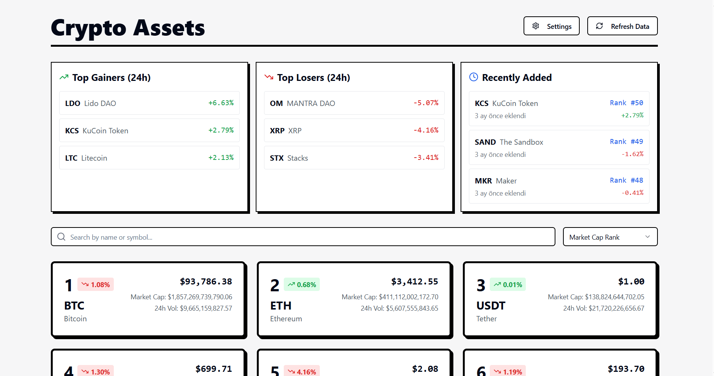

# Crypto Asset Tracker with XAI Integration

<div align="center">
  
  <p><em>Real-time cryptocurrency tracking dashboard with AI-powered analysis</em></p>
</div>

A modern cryptocurrency tracking application that provides real-time market data and AI-powered analysis using XAI (X.AI) technology.

## Features

- **Real-time Cryptocurrency Data**
  - Live price updates
  - Market cap tracking
  - 24-hour volume monitoring
  - Price change percentages

- **Smart Analytics**
  - AI-powered market analysis using XAI
  - Technical analysis for each cryptocurrency
  - Market sentiment analysis
  - Future trend predictions

- **Interactive Dashboard**
  - Top gainers and losers
  - Recently added cryptocurrencies
  - Detailed asset information
  - Search and filter capabilities

- **Settings Management**
  - Secure API key storage using Supabase
  - Easy configuration interface
  - API key visibility controls

## Technology Stack

- **Frontend**
  - React with TypeScript
  - Vite for build tooling
  - TailwindCSS for styling
  - shadcn/ui for UI components
  - React Query for data fetching

- **Backend & Storage**
  - Supabase for database
  - XAI (X.AI) for AI analysis
  - CoinCap API for market data

## Getting Started

1. **Clone the repository**
   ```bash
   git clone <repository-url>
   cd crypto-asset-tracker
   ```

2. **Install dependencies**
   ```bash
   npm install
   ```

3. **Environment Setup**
   Create a `.env` file in the root directory with the following variables:
   ```env
   VITE_SUPABASE_URL=your_supabase_url
   VITE_SUPABASE_ANON_KEY=your_supabase_anon_key
   ```

4. **Start the development server**
   ```bash
   npm run dev
   ```

5. **Configure XAI API Key**
   - Navigate to the Settings page
   - Add your XAI API key
   - Save the configuration

## Project Structure

```
src/
├── components/     # Reusable UI components
├── pages/         # Page components
├── lib/           # Utility functions and API clients
├── api/           # API integration logic
└── types/         # TypeScript type definitions
```

## Contributing

1. Fork the repository
2. Create your feature branch (`git checkout -b feature/amazing-feature`)
3. Commit your changes (`git commit -m 'Add some amazing feature'`)
4. Push to the branch (`git push origin feature/amazing-feature`)
5. Open a Pull Request

## License

This project is licensed under the MIT License - see the LICENSE file for details.

## Acknowledgments

- [Supabase](https://supabase.com/) for database services
- [XAI](https://x.ai/) for AI analysis capabilities
- [CoinCap](https://coincap.io/) for cryptocurrency market data
- [shadcn/ui](https://ui.shadcn.com/) for beautiful UI components
